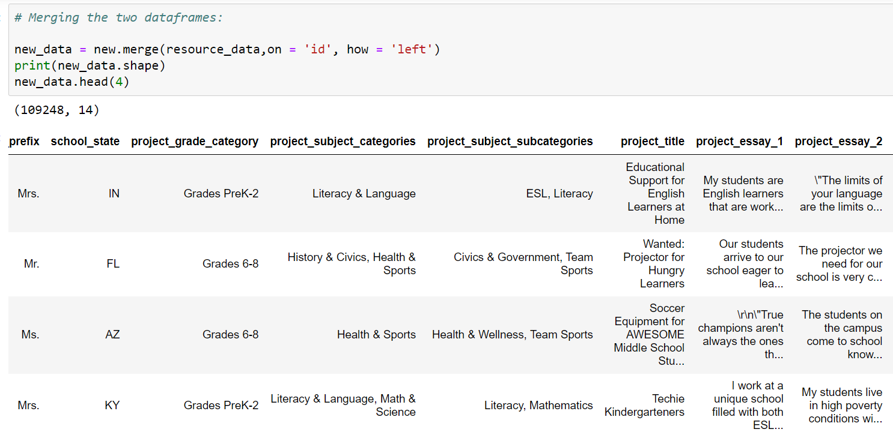
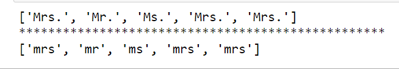
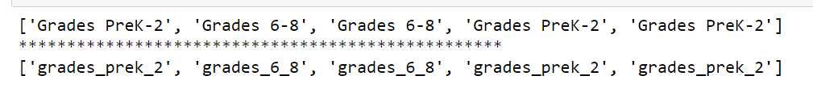
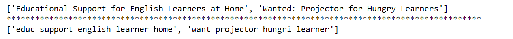
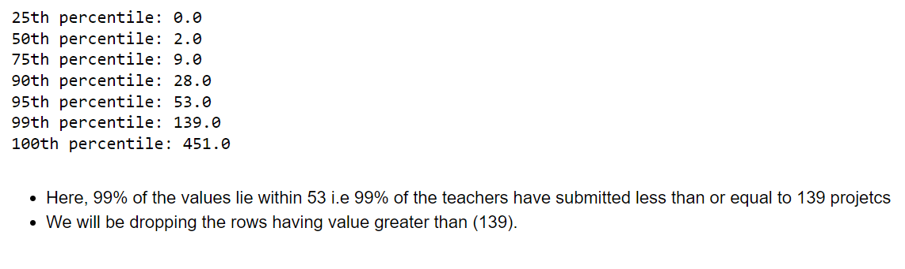
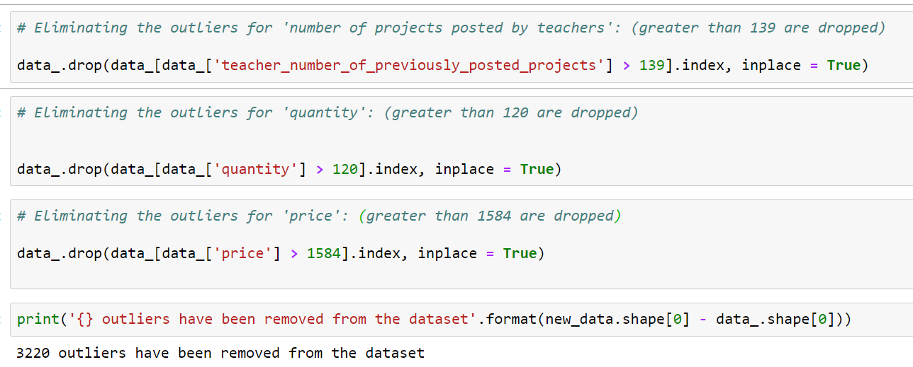
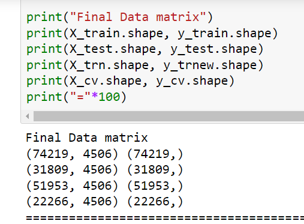
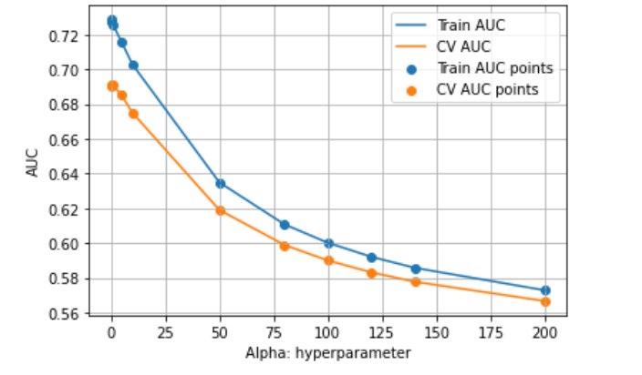
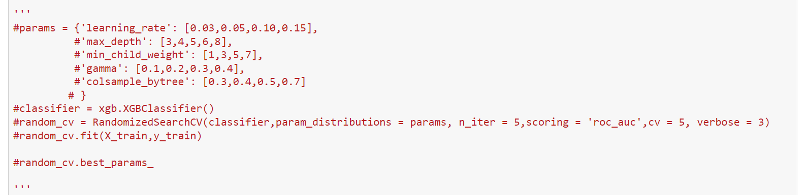
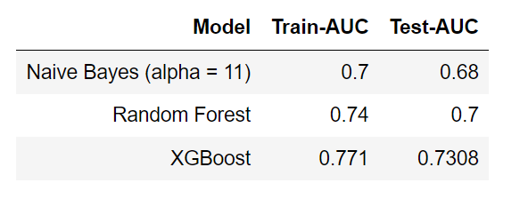

# Donors Choose

This is a detailed case study which involves interesting EDA, lot of
data cleaning and removal of outliers along with hyperparameter tuning for multiple models to get better predictions.

This is a binary classification problem where the model predicts whether a proposed project will be approved or not.
The metric used is "AUC score". As the dataset involves a lot of text data I have used "Naive Bayes" as the baseline model.

## Motivation

DonorsChoose.org receives hundreds of thousands of project proposals each year for classroom projects in need of funding. Currently, a large number of volunteers are needed to manually screen each submission before it's approved to be posted on the DonorsChoose.org website.

Therefore, to save this screen time I have developed multiple models which takes into consideration 
various parameters of the project and predicts whether it will be approved to be posted on website for funding or not. 

The model takes care of most of the projects and thus helps the volunteers to focus on less number of projects which need thorough analysis for approval.
## Data Overview
We have two datasets for this task.

1. Project Data.
This contains all the meta data related to
 teachers involved, number of projects from different states of US, differnt categories of projects and short essays describing the project.

 2. Resource Data.
 This talks about the description,quantity and price of different items needed to complete the projects.
 For a given project there could be multiple resources involved hence, we have to take that into account as well while merging the two datasets.
 
  
  After merging these 2 datasets, the final dataframe looks like:

  

## Data Cleaning

⚪Missing Values: 

The missing values for categorical features are replaced by the most frequent occuring value for that particular categorical feature.

⚪Cleaning categorical feature:

For different features we have employed different cleaning techniques, but the general steps followed are mentioned below:
- We remove special characters, numeric values and punctuations.

- We replace the empty spaces by empty string and the hypen (-) by underscore (_)

- Non alpha numeric values are replaced by (_) for "subject category".

Below are some snapshots of how the data looks before and after cleaning.

⚪Cleaning Text data:

- Removing Stopwords, punctuations, numeric values.
- We remove certain words from the list of "stopwords" to preserve the meaning of title.
- Contracted words are expanded (won't ---> will not)
- Snowball stemmer is used to return the root form of words.

⚪ Removing outliers:

We basically check the outliers present through the percentile values, we  remove the values which fall beyond the 99th percentile value.

Here is one snapshot of outlier prediction (prediction because we are not using a robust method such as LOF for outlier detection)

Here, we remove the outliers from the dataset.

## Data preprocessing

⚪ One hot encoding on categorical features :
- Teacher prefix
- School State
- Project Grade
- Subject Category 
   
⚪ TFIDF vectorization applied on :
- Project title
- Essay
- Resource summary

⚪ Normalization applied on :
- Number of previously posted projects
- Quantity
- Price
   

⚪ Concatenating all features after vectorizations:

## Models

⚪ Naive Bayes:

- Calculate the Train and CV AUC scores, for different values of alpha.
- Select the best value of alpha for which difference in Train & CV Score is less.   
- We find out the best alpha to be (11), fit the entire train data with this parameter and Calculate the scores.

Below we see the scores and find the best value of alpha:

⚪ Random Forest:

- We perform hyperparameter tuning through RandomizedSearchCV to obtain best parameters to fit the data
- Fine tuning of the obtained best parameters is done to avoid overfitting to the training data.

RandomizedSearchCV for Random Forest:

⚪ XGboost:

RandomizedSearchCV for XGboost:

( We get best results with XGBoost!! ) 

## Results

The following table shows AUC scores obained with different models.

